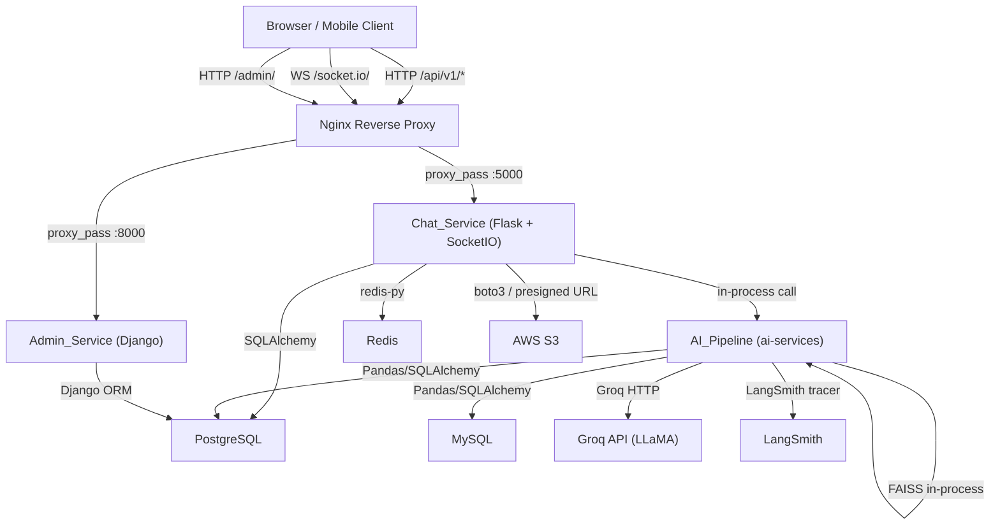
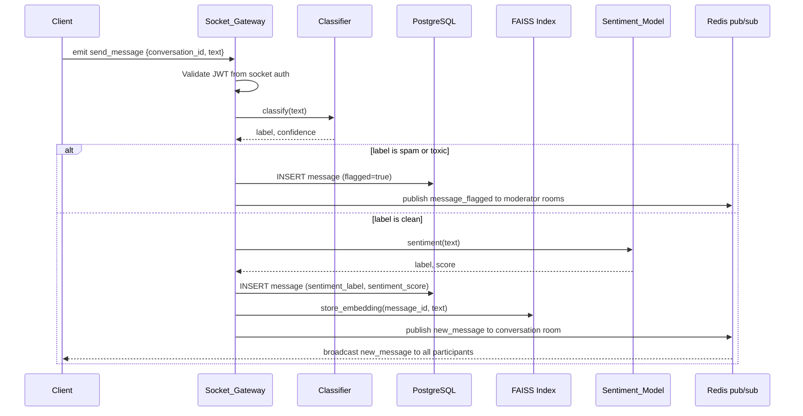
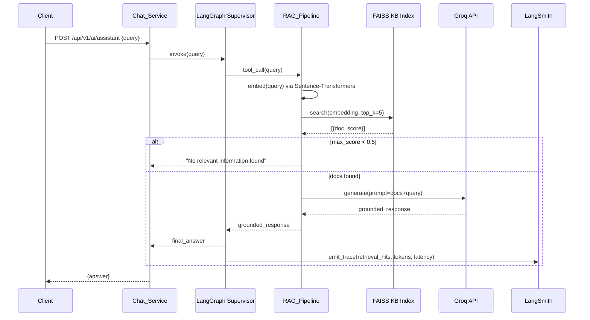
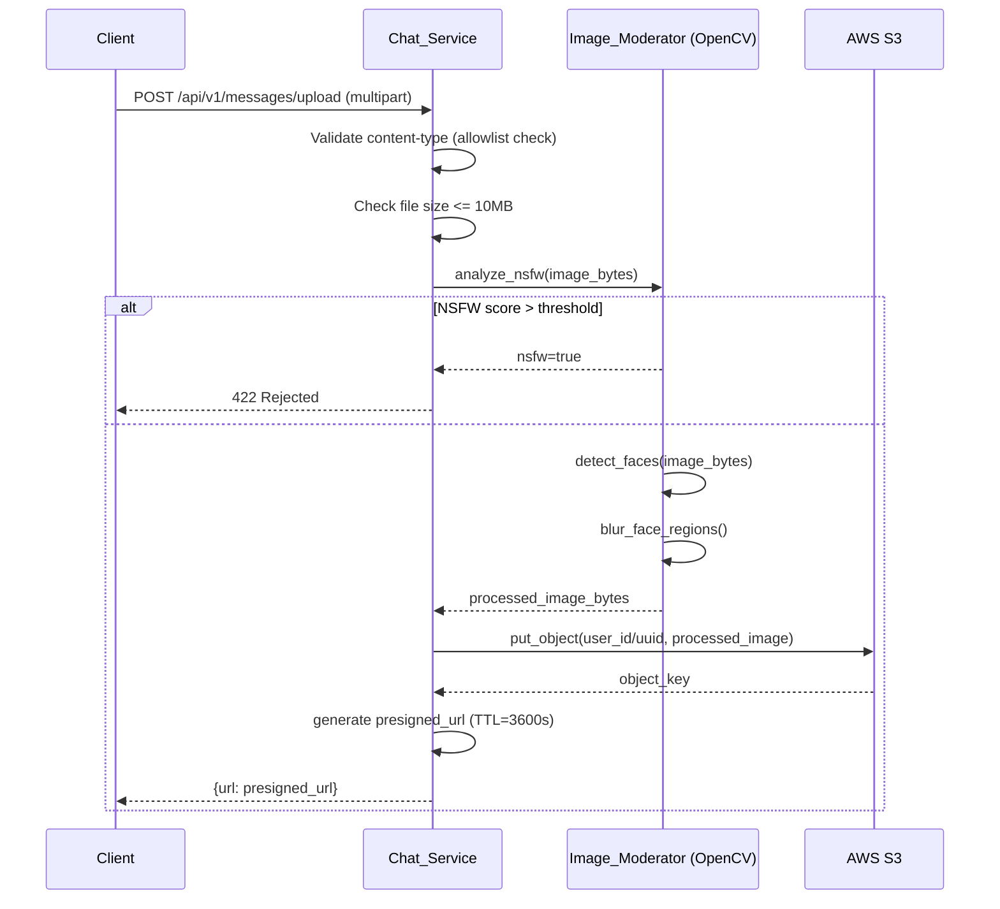
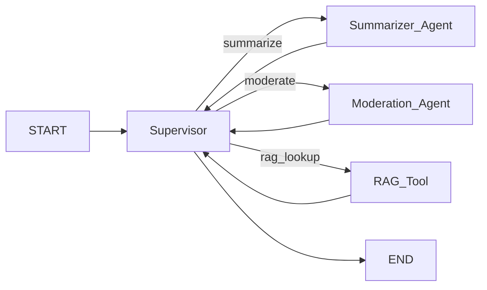

# Design Document: AI-Powered Real-Time Chat Platform

## Overview

This document describes the technical design for the AI-Powered Real-Time Chat Platform — a production-grade, full-stack portfolio capstone. The system integrates real-time WebSocket messaging, multi-model AI pipelines (RAG, LangGraph agents, Scikit-Learn classifiers, TensorFlow sentiment analysis), RBAC-secured REST APIs, multi-database persistence (PostgreSQL + MySQL), image moderation via OpenCV, and a complete DevOps pipeline (Docker Compose, GitHub Actions, Kubernetes).

The platform is structured as a monorepo with six top-level directories:

| Directory | Purpose |
|---|---|
| `/frontend` | React 18 SPA (Vite, Tailwind CSS, Framer Motion, Socket.IO client, Recharts) |
| `/backend-flask` | Chat_Service: Flask + Flask-SocketIO REST API and WebSocket gateway |
| `/backend-django` | Admin_Service: Django admin panel for user management |
| `/ai-services` | AI_Pipeline: RAG, LangGraph, Scikit-Learn, TensorFlow, Analytics Engine |
| `/infra` | Docker Compose, Kubernetes manifests |
| `/tests` | Postman collections, Selenium e2e tests |

**Technology decisions:**

- **Flask** chosen for Chat_Service because Flask-SocketIO provides tight Socket.IO integration and the async event model aligns with real-time messaging. Flask-JWT-Extended gives fine-grained token lifecycle control.
- **Django** used only for the admin panel because Django admin ships a full-featured CRUD UI for user management out of the box.
- **Redis** serves triple duty: Socket.IO pub/sub adapter (multi-instance fan-out), rate-limit sliding-window counters, and presence/session cache — avoiding an additional message broker dependency.
- **PostgreSQL** is the primary transactional store (users, conversations, messages, notifications, tokens) and **MySQL** is the secondary analytics store so that expensive aggregation queries against rollup tables do not compete with OLTP traffic on PostgreSQL.
- **FAISS** for vector similarity search is an in-process library (no network hop), which keeps semantic search latency sub-100 ms without deploying a dedicated vector database.

## Architecture

### High-Level Component Diagram



### Request Routing

All external traffic enters through **Nginx**, which handles:
- TLS termination (in production)
- Routing `/api/v1/*` and `/socket.io/*` to Chat_Service on port 5000
- Routing `/admin/*` to Admin_Service on port 8000
- Serving the React SPA static bundle at `/`

### Multi-Instance Scaling

The Chat_Service is horizontally scalable. Multiple Flask instances share state through:
1. **Redis** for Socket.IO pub/sub (flask-socketio `message_queue` parameter pointing to Redis)
2. **PostgreSQL** for all persistent state
3. **Redis** for JWT revocation store and rate-limit counters

### Data Flow: Send a Real-Time Message



### Data Flow: AI Support Assistant (RAG)



### Data Flow: Image Upload with Moderation



## Components and Interfaces

### Chat_Service (Flask)

The Chat_Service is the central hub of the platform. It owns:
- All REST API endpoints under `/api/v1/`
- Socket.IO event handling via Flask-SocketIO
- JWT issuance, validation, and revocation
- Rate limiting via Redis sliding-window counters
- Orchestration calls into AI_Pipeline functions
- S3 file upload and presigned URL generation

**Module structure:**
```
backend-flask/
  app/
    __init__.py          # App factory: create_app(), registers blueprints + SocketIO
    auth.py              # /api/v1/auth/* endpoints, JWT helpers, bcrypt
    routes.py            # Conversation, message, user, AI, analytics, moderation endpoints
    socket_events.py     # SocketIO event handlers (send_message, typing, presence, etc.)
    ai_service.py        # Thin orchestration wrappers calling ai-services functions
    rate_limiter.py      # Redis sliding-window decorator for REST and WebSocket
    security.py          # Security header middleware, input validation/sanitization
    models.py            # SQLAlchemy ORM models (User, Conversation, Message, etc.)
    migrations/          # Alembic migration scripts
  app.py                 # Entry point: calls create_app()
  requirements.txt
  Dockerfile
```

**Key design decision:** `ai_service.py` in the Flask app acts only as an orchestration facade. It imports and calls functions from the `ai-services/` package. This keeps the HTTP/WebSocket concerns separate from ML model code and lets the AI_Pipeline be tested independently.

### Admin_Service (Django)

The Admin_Service is a thin Django application whose sole purpose is providing the Django admin panel (`/admin/`) for user management. It shares the PostgreSQL database with Chat_Service via environment-variable-configured `DATABASE_URL`.

```
backend-django/
  chatapp/
    settings.py          # DB, auth, installed apps
    urls.py              # /admin/ + health endpoint
  users/
    models.py            # Mirrors Chat_Service User model (read-only for admin)
    admin.py             # UserAdmin registration: list, create, deactivate, role assignment
  manage.py
  Dockerfile
```

### AI_Pipeline (ai-services)

The AI_Pipeline package contains all ML/AI model code, organized as a single importable Python package. Chat_Service calls into this package in-process.

```
ai-services/
  __init__.py
  pipeline.py            # AIPipeline class (legacy stub — replaced by module below)
  classifier.py          # Scikit-Learn model loader + classify(text) -> (label, confidence)
  sentiment.py           # TensorFlow/Keras model loader + predict(text) -> (label, score)
  smart_reply.py         # Groq client wrapper + Redis semantic cache
  summarizer.py          # LangGraph graph definition (Supervisor, Summarizer, Moderation nodes)
  rag_pipeline.py        # Sentence-Transformers encoder + FAISS index + Groq grounding
  image_moderator.py     # OpenCV NSFW detector + face blur
  analytics_engine.py    # Pandas/NumPy aggregations -> dict metrics
  embeddings_store.py    # FAISS index for message embeddings (search + upsert)
  models/
    classifier.joblib    # Trained Scikit-Learn classifier (committed or downloaded at startup)
    sentiment_model/     # Saved TensorFlow/Keras model directory
  Dockerfile
```

**Model loading strategy:** `classifier.py` and `sentiment.py` each use a module-level singleton pattern — the model is loaded once at import time (or explicitly via `load_model()` called from the Flask app factory `create_app()`). This satisfies Requirement 8.7.

### Socket_Gateway (within Chat_Service)

The Socket_Gateway is implemented inside Chat_Service as the Flask-SocketIO layer. Key events and their responsibilities:

| Event (inbound) | Handler action |
|---|---|
| `connect` | Validate JWT from `auth` query param; reject with error code 4001 if invalid; publish user presence `online` to Redis |
| `disconnect` | Set Redis presence key to `offline`; publish `presence_update` to user's conversation rooms |
| `join_conversation` | Add socket to SocketIO room for `conversation_id` |
| `send_message` | Rate-limit check; validate text; invoke Classifier; persist to PostgreSQL; store embedding; broadcast `new_message` or `message_flagged` |
| `typing` | Broadcast `typing_indicator` to room (within 200 ms — no DB call) |
| `get_presence` | Read Redis presence keys for requested user IDs; return `presence_status` map |

| Event (outbound) | Triggered by |
|---|---|
| `new_message` | Successful message classification and persistence |
| `message_flagged` | Message classified as spam/toxic |
| `message_deleted` | Soft-delete REST endpoint called |
| `typing_indicator` | Inbound `typing` event |
| `read_receipt` | Conversation opened by participant |
| `presence_update` | User connect/disconnect or status update |
| `rate_limit_exceeded` | WebSocket rate limit reached |

### Frontend (React SPA)

```
frontend/src/
  main.jsx               # React DOM root, router setup
  App.jsx                # Root component, socket connection, auth state
  components/
    layout/
      Sidebar.jsx        # Navigation: Chats, AI Assistant, Analytics, Settings
      SplitPane.jsx      # Responsive split-pane layout (conversation list + active pane)
    auth/
      LoginForm.jsx      # Login form component
      RegisterForm.jsx   # Registration form component
    chat/
      ConversationList.jsx   # Sidebar conversation list with unread badges
      MessageThread.jsx      # Scrollable message list with Framer Motion animations
      MessageBubble.jsx      # Individual message card (text, file, sentiment badge)
      MessageInput.jsx       # Draft input, typing emission, send button
      SmartReplyBar.jsx      # 2-3 suggestion chips below input
      TypingIndicator.jsx    # "X is typing..." animated indicator
    ai/
      AIAssistant.jsx        # RAG assistant chat panel
      SummarizeButton.jsx    # One-click summarization trigger
    analytics/
      AnalyticsDashboard.jsx # Recharts: volume time-series, sentiment bar chart, flagged count
    notifications/
      ToastNotification.jsx  # Toast popup for new messages
      NotificationCenter.jsx # Persistent sidebar notification list with read/unread state
    profile/
      UserProfile.jsx        # Profile view/edit form, avatar upload
    moderation/
      FlaggedMessages.jsx    # Moderator/admin view of flagged content
    common/
      Avatar.jsx             # Avatar image with initials fallback
      ThemeToggle.jsx        # Dark/light mode toggle, persists to localStorage
  hooks/
    useSocket.js             # Socket.IO connection management, event subscription
    useAuth.js               # JWT storage, login/logout, refresh token rotation
    useRateLimit.js          # Client-side send throttle UI feedback
  store/
    authSlice.js             # Auth state (Zustand or React Context)
    chatSlice.js             # Messages, conversations state
    notificationSlice.js     # Notification list state
  api/
    client.js                # Axios instance with JWT interceptor and refresh logic
    auth.js                  # Auth API calls
    conversations.js         # Conversation/message API calls
    ai.js                    # AI endpoint calls (smart-replies, summarize, assistant, search)
    analytics.js             # Analytics endpoint call
```

**Frontend dependencies to add** (beyond current package.json):
- `recharts` — analytics charts
- `axios` — HTTP client with interceptors
- `zustand` — lightweight state management
- `react-hot-toast` — toast notifications
- `vitest` + `@testing-library/react` — unit testing

## API Design

### REST Endpoints (Chat_Service — Flask)

All endpoints are prefixed with `/api/v1/`. All endpoints except the auth registration/login routes require a valid JWT access token in the `Authorization: Bearer <token>` header.

#### Authentication

| Method | Path | Auth | Role | Description |
|---|---|---|---|---|
| POST | `/auth/register` | None | — | Register new user |
| POST | `/auth/login` | None | — | Login, returns access + refresh tokens |
| POST | `/auth/refresh` | Refresh token | — | Issue new access token |
| POST | `/auth/logout` | Bearer | any | Revoke refresh token |

**POST /auth/register** request:
```json
{ "email": "user@example.com", "name": "Alice", "password": "s3cur3!" }
```
Response 201: `{ "id": "uuid", "email": "...", "name": "..." }`
Response 409: `{ "error": "Email already in use" }`

**POST /auth/login** request:
```json
{ "email": "user@example.com", "password": "s3cur3!" }
```
Response 200: `{ "access_token": "...", "refresh_token": "...", "user": {...} }`
Response 401: `{ "error": "Invalid credentials" }`

#### Users

| Method | Path | Auth | Role | Description |
|---|---|---|---|---|
| GET | `/users/me` | Bearer | any | Get own profile |
| PATCH | `/users/me` | Bearer | any | Update name, status, bio |
| POST | `/users/me/avatar` | Bearer | any | Upload avatar image |

#### Conversations

| Method | Path | Auth | Role | Description |
|---|---|---|---|---|
| POST | `/conversations` | Bearer | any | Create conversation |
| GET | `/conversations` | Bearer | any | List caller's conversations |
| GET | `/conversations/{id}/messages` | Bearer | participant | Paginated message history |

**GET /conversations/{id}/messages** query params: `page` (default 1), `page_size` (default 50, max 100)

Response schema:
```json
{
  "messages": [...],
  "page": 1,
  "page_size": 50,
  "total": 423,
  "has_next": true
}
```

#### Messages

| Method | Path | Auth | Role | Description |
|---|---|---|---|---|
| DELETE | `/messages/{id}` | Bearer | sender/moderator/admin | Soft delete message |
| POST | `/messages/upload` | Bearer | any | Upload file/image |

#### AI Features

| Method | Path | Auth | Role | Description |
|---|---|---|---|---|
| POST | `/ai/smart-replies` | Bearer | any | Generate 2-3 smart reply suggestions |
| POST | `/ai/summarize` | Bearer | any | Summarize conversation via LangGraph |
| POST | `/ai/assistant` | Bearer | any | RAG support assistant query |
| POST | `/ai/search` | Bearer | any | Semantic message search |

**POST /ai/smart-replies** request: `{ "text": "message text" }`
Response: `{ "replies": ["...", "...", "..."], "cache_hit": false }`

**POST /ai/summarize** request: `{ "conversation_id": "uuid" }`
Response: `{ "summary": "...", "word_count": 143 }`
Response 503: `{ "error": "Summarization service unavailable, please try again" }`

**POST /ai/assistant** request: `{ "query": "How do I start a new chat?" }`
Response: `{ "answer": "...", "sources": [{"title": "...", "score": 0.82}] }`

**POST /ai/search** request: `{ "query": "discussion about deployment" }`
Response:
```json
{
  "results": [
    {
      "message_id": "uuid",
      "conversation_id": "uuid",
      "sender": "Alice",
      "text": "...",
      "similarity_score": 0.91
    }
  ]
}
```

#### Moderation (Moderator/Admin only)

| Method | Path | Auth | Role | Description |
|---|---|---|---|---|
| GET | `/moderation/flagged` | Bearer | moderator/admin | List flagged messages (paginated) |
| POST | `/moderation/messages/{id}/dismiss` | Bearer | moderator/admin | Clear flagged status and broadcast |

#### Analytics (Admin only)

| Method | Path | Auth | Role | Description |
|---|---|---|---|---|
| GET | `/analytics` | Bearer | admin | Aggregated platform metrics |

**GET /analytics** response schema:
```json
{
  "message_volume": 15420,
  "active_users": 87,
  "sentiment_trend": [
    { "date": "2024-01-15", "positive": 0.62, "neutral": 0.28, "negative": 0.10 }
  ],
  "response_time_ms": 230,
  "flagged_message_count": 14,
  "ai_insights": {
    "smart_reply_requests": 3200,
    "cache_hits": 1100,
    "avg_latency_ms": 310
  }
}
```

#### Notifications

| Method | Path | Auth | Role | Description |
|---|---|---|---|---|
| GET | `/notifications` | Bearer | any | List unread notifications |
| POST | `/notifications/{id}/read` | Bearer | any | Mark notification as read |

### Socket.IO Events

**Connection:** `ws://{host}/socket.io/?token={access_token}`

The JWT access token is passed as a URL query parameter during the WebSocket handshake. The Socket_Gateway validates it and rejects the connection with error code `4001` if it is absent or invalid.

#### Client → Server Events

| Event | Payload | Description |
|---|---|---|
| `join_conversation` | `{ conversation_id }` | Join a conversation room |
| `leave_conversation` | `{ conversation_id }` | Leave a conversation room |
| `send_message` | `{ conversation_id, text, file_url? }` | Send a message |
| `typing` | `{ conversation_id }` | Signal typing state |
| `get_presence` | `{ user_ids: [...] }` | Request presence status for users |

#### Server → Client Events

| Event | Payload | Description |
|---|---|---|
| `new_message` | `{ id, conversation_id, sender_id, text, file_url, sentiment_label, created_at }` | New message delivered |
| `message_flagged` | `{ message_id, sender_id, classification_label }` | Message flagged (to moderators/admins) |
| `message_deleted` | `{ message_id, conversation_id }` | Message soft-deleted |
| `typing_indicator` | `{ conversation_id, user_id, name }` | User is typing |
| `read_receipt` | `{ conversation_id, user_id, timestamp }` | Participant read the conversation |
| `presence_update` | `{ user_id, status, online }` | User presence/status changed |
| `presence_status` | `{ statuses: { user_id: "online"|"offline" } }` | Response to get_presence |
| `rate_limit_exceeded` | `{ retry_after_seconds }` | Client has exceeded WebSocket rate limit |

### Admin_Service REST (Django)

| Path | Description |
|---|---|
| `/admin/` | Django admin panel (requires admin session) |
| `/health` | Health check endpoint |

## Data Models

### PostgreSQL Schema

#### `users`
```sql
CREATE TABLE users (
    id            UUID PRIMARY KEY DEFAULT gen_random_uuid(),
    email         VARCHAR(255) UNIQUE NOT NULL,
    name          VARCHAR(100) NOT NULL,
    role          VARCHAR(20) NOT NULL DEFAULT 'user'
                      CHECK (role IN ('user', 'moderator', 'admin')),
    password_hash VARCHAR(72) NOT NULL,   -- bcrypt output is max 60 chars; 72 for safety
    avatar_url    TEXT,
    status        VARCHAR(100),
    bio           TEXT,
    created_at    TIMESTAMPTZ NOT NULL DEFAULT NOW(),
    deleted_at    TIMESTAMPTZ           -- soft-delete for Admin_Service deactivation
);
```

#### `conversations`
```sql
CREATE TABLE conversations (
    id         UUID PRIMARY KEY DEFAULT gen_random_uuid(),
    name       VARCHAR(200) NOT NULL,
    type       VARCHAR(20) NOT NULL DEFAULT 'group'
                   CHECK (type IN ('direct', 'group')),
    created_at TIMESTAMPTZ NOT NULL DEFAULT NOW()
);
```

#### `conversation_participants`
```sql
CREATE TABLE conversation_participants (
    conversation_id UUID NOT NULL REFERENCES conversations(id) ON DELETE CASCADE,
    user_id         UUID NOT NULL REFERENCES users(id) ON DELETE CASCADE,
    joined_at       TIMESTAMPTZ NOT NULL DEFAULT NOW(),
    PRIMARY KEY (conversation_id, user_id)
);
```

#### `messages`
```sql
CREATE TABLE messages (
    id                   UUID PRIMARY KEY DEFAULT gen_random_uuid(),
    conversation_id      UUID NOT NULL REFERENCES conversations(id) ON DELETE CASCADE,
    sender_id            UUID NOT NULL REFERENCES users(id),
    text                 TEXT,
    file_url             TEXT,
    sentiment_label      VARCHAR(20)
                             CHECK (sentiment_label IN ('positive', 'neutral', 'negative')),
    sentiment_score      FLOAT,
    classification_label VARCHAR(20)
                             CHECK (classification_label IN ('clean', 'spam', 'toxic')),
    classification_conf  FLOAT,
    flagged              BOOLEAN NOT NULL DEFAULT FALSE,
    deleted_at           TIMESTAMPTZ,
    created_at           TIMESTAMPTZ NOT NULL DEFAULT NOW()
);

-- Indexes for paginated history queries (Requirement 17.5)
CREATE INDEX idx_messages_conversation_id ON messages (conversation_id);
CREATE INDEX idx_messages_created_at      ON messages (created_at DESC);
-- Composite for most common query: messages in a conversation ordered by time
CREATE INDEX idx_messages_conv_time       ON messages (conversation_id, created_at DESC);
```

#### `notifications`
```sql
CREATE TABLE notifications (
    id         UUID PRIMARY KEY DEFAULT gen_random_uuid(),
    user_id    UUID NOT NULL REFERENCES users(id) ON DELETE CASCADE,
    type       VARCHAR(50) NOT NULL,   -- e.g. 'new_message', 'message_flagged'
    payload    JSONB NOT NULL,         -- flexible: {conversation_id, sender_name, preview}
    read_at    TIMESTAMPTZ,
    created_at TIMESTAMPTZ NOT NULL DEFAULT NOW()
);

CREATE INDEX idx_notifications_user_unread ON notifications (user_id, read_at)
    WHERE read_at IS NULL;
```

#### `refresh_tokens`
```sql
CREATE TABLE refresh_tokens (
    jti        VARCHAR(36) PRIMARY KEY,  -- JWT ID claim (uuid4)
    user_id    UUID NOT NULL REFERENCES users(id) ON DELETE CASCADE,
    expires_at TIMESTAMPTZ NOT NULL,
    revoked_at TIMESTAMPTZ               -- NULL means still valid
);

CREATE INDEX idx_refresh_tokens_user ON refresh_tokens (user_id);
```

### MySQL Schema (Analytics)

#### `analytics_daily_rollup`
```sql
CREATE TABLE analytics_daily_rollup (
    id           BIGINT UNSIGNED AUTO_INCREMENT PRIMARY KEY,
    date         DATE NOT NULL,
    metric_name  VARCHAR(100) NOT NULL,
    metric_value DOUBLE NOT NULL,
    created_at   DATETIME NOT NULL DEFAULT CURRENT_TIMESTAMP,
    UNIQUE KEY uq_daily_metric (date, metric_name)
);
```

#### `ai_usage_stats`
```sql
CREATE TABLE ai_usage_stats (
    id              BIGINT UNSIGNED AUTO_INCREMENT PRIMARY KEY,
    date            DATE NOT NULL,
    endpoint        VARCHAR(100) NOT NULL,
    request_count   INT UNSIGNED NOT NULL DEFAULT 0,
    cache_hits      INT UNSIGNED NOT NULL DEFAULT 0,
    avg_latency_ms  FLOAT NOT NULL DEFAULT 0,
    UNIQUE KEY uq_daily_endpoint (date, endpoint)
);
```

### Redis Key Patterns

| Key Pattern | Value | TTL | Purpose |
|---|---|---|---|
| `presence:{user_id}` | `"online"` \| `"offline"` | None (updated on connect/disconnect) | User presence |
| `revoked:{jti}` | `"1"` | Until token expiry | JWT revocation |
| `ratelimit:rest:{user_id}` | sliding-window counter | 60 s window | REST rate limit |
| `ratelimit:ws:{user_id}` | sliding-window counter | 60 s window | WS message rate limit |
| `ratelimit:auth:{ip}` | sliding-window counter | 60 s window | Auth brute-force limit |
| `smartreply:{text_hash}` | JSON array of suggestions | 60 s | Smart reply semantic cache |

### FAISS Indexes

Two separate FAISS `IndexFlatIP` (inner product / cosine when normalized) indexes:
1. **Knowledge Base Index** (`kb.faiss`) — pre-built from help documentation; loaded read-only at startup; used by RAG_Pipeline assistant queries.
2. **Message Embeddings Index** (`messages.faiss`) — writable index; one vector per persisted message; used for semantic message search. Periodically persisted to disk.

**Embedding model:** `sentence-transformers/all-MiniLM-L6-v2` — 384-dimensional, ~22 MB, fast inference, good semantic quality for English.

### SQLAlchemy ORM Models (Python)

The Flask app defines SQLAlchemy models in `backend-flask/app/models.py` mirroring the PostgreSQL schema above. The Django admin mirrors the `User` table via a `managed = False` Django model to avoid schema conflicts.

**Alembic migration workflow:**
```bash
flask db init          # first time only
flask db migrate -m "initial schema"
flask db upgrade
```

## AI/ML Pipeline Architecture

### Scikit-Learn Message Classifier

The Classifier is a **TF-IDF + Logistic Regression** pipeline trained on a labeled message dataset and serialized to `ai-services/models/classifier.joblib`.

```
text -> TfidfVectorizer (ngram_range=(1,2), max_features=50000)
     -> LogisticRegression (C=1.0, multi_class='multinomial', max_iter=1000)
     -> (label: clean|spam|toxic, confidence: float)
```

**Loading:** The model is loaded once at module import:
```python
# classifier.py
import joblib, os
_MODEL_PATH = os.path.join(os.path.dirname(__file__), "models", "classifier.joblib")
_clf = joblib.load(_MODEL_PATH)   # loaded at import — not per-request

def classify(text: str) -> tuple[str, float]:
    proba = _clf.predict_proba([text])[0]
    label = _clf.classes_[proba.argmax()]
    confidence = float(proba.max())
    return label, confidence
```

**Borderline routing:** If `0.4 <= confidence <= 0.6`, the result is treated as borderline and the `LangGraph_Agent` Moderation_Agent node is invoked for a deep check using the Groq API.

### TensorFlow/Keras Sentiment Model

The Sentiment_Model is a **text classification model** built with Keras `TextVectorization` + embedding + bidirectional LSTM layers:

```
text -> TextVectorization (vocab_size=20000, sequence_length=100)
     -> Embedding (dim=64)
     -> Bidirectional LSTM (64 units)
     -> Dense (3, softmax)
     -> (label: positive|neutral|negative, score: float)
```

The saved model directory is at `ai-services/models/sentiment_model/`. It is loaded via `tf.keras.models.load_model()` at startup.

### Groq API Client (LLM)

All generative AI calls go through the **Groq API** using the `groq` Python SDK. The default model is `llama3-70b-8192`. A 5-second timeout is set on all calls.

```python
# smart_reply.py
from groq import Groq
import redis, hashlib, json, os

_groq = Groq(api_key=os.environ["GROQ_API_KEY"])
_redis = redis.from_url(os.environ["REDIS_URL"])
_CACHE_TTL = 60  # seconds

def generate_smart_replies(text: str, context: list[str]) -> list[str]:
    cache_key = "smartreply:" + hashlib.sha256(text.encode()).hexdigest()[:16]
    cached = _redis.get(cache_key)
    if cached:
        return json.loads(cached)

    response = _groq.chat.completions.create(
        model="llama3-70b-8192",
        messages=[
            {"role": "system", "content": "Generate exactly 3 short reply suggestions..."},
            *[{"role": "user", "content": m} for m in context[-5:]],
            {"role": "user", "content": text},
        ],
        timeout=5,
    )
    replies = _parse_suggestions(response.choices[0].message.content)
    _redis.setex(cache_key, _CACHE_TTL, json.dumps(replies))
    return replies
```

### LangGraph Multi-Agent System

The LangGraph graph is defined in `ai-services/summarizer.py`. It uses a **Supervisor pattern** with three nodes:



- **Supervisor node:** Routes tasks based on the incoming request type. Uses `langchain_groq.ChatGroq` with tool calling to decide which sub-agent to invoke.
- **Summarizer_Agent node:** Calls Groq with the full message history, returns a summary <= 250 words.
- **Moderation_Agent node:** Called for borderline classifications; uses Groq to make a final clean/spam/toxic determination.
- **RAG_Tool node:** Wraps `rag_pipeline.answer(query)` as a LangGraph tool so the Supervisor can delegate knowledge-base queries.

**Extensibility design (Requirement 9.6):** New agent nodes are added as new `StateGraph` nodes connected to the Supervisor node. Existing node functions do not need modification because the Supervisor uses tool calling — adding a new tool to the Supervisor's tool list is sufficient.

**LangSmith tracing:** All graph executions are traced by setting the `LANGCHAIN_API_KEY` and `LANGCHAIN_TRACING_V2=true` environment variables. The LangChain/LangGraph framework automatically emits traces without code changes.

### RAG Pipeline

```python
# rag_pipeline.py
from sentence_transformers import SentenceTransformer
import faiss, numpy as np
from groq import Groq

_encoder = SentenceTransformer("all-MiniLM-L6-v2")
_index = faiss.read_index("models/kb.faiss")
_docs: list[dict] = []    # parallel list to _index

SIMILARITY_THRESHOLD = 0.5

def answer(query: str) -> str:
    query_vec = _encoder.encode([query], normalize_embeddings=True)
    scores, indices = _index.search(query_vec.astype(np.float32), k=5)

    retrieved = [
        {"doc": _docs[i], "score": float(scores[0][j])}
        for j, i in enumerate(indices[0])
        if i >= 0 and float(scores[0][j]) >= SIMILARITY_THRESHOLD
    ]

    if not retrieved:
        return "No relevant information found in the knowledge base."

    context = "\n\n".join(d["doc"]["content"] for d in retrieved)
    response = _groq_client.chat.completions.create(
        model="llama3-70b-8192",
        messages=[
            {"role": "system", "content": f"Answer based only on this context:\n{context}"},
            {"role": "user", "content": query},
        ],
    )
    return response.choices[0].message.content
```

### Message Embeddings Store (Semantic Search)

The message embeddings index uses a separate FAISS file (`messages.faiss`) with a metadata store (list of `{message_id, conversation_id, sender, text}` dicts) in a companion JSON file. This keeps the implementation simple while avoiding a separate vector database service.

```python
# embeddings_store.py
def index_message(message_id, conversation_id, sender, text):
    vec = _encoder.encode([text], normalize_embeddings=True)
    _index.add(vec.astype(np.float32))
    _metadata.append({"message_id": message_id, "conversation_id": conversation_id,
                       "sender": sender, "text": text})

def search(query: str, caller_conversation_ids: set, top_k=10) -> list[dict]:
    query_vec = _encoder.encode([query], normalize_embeddings=True)
    scores, indices = _index.search(query_vec.astype(np.float32), k=top_k * 3)
    results = []
    for score, idx in zip(scores[0], indices[0]):
        if idx < 0: continue
        meta = _metadata[idx]
        if meta["conversation_id"] not in caller_conversation_ids:
            continue    # enforce scoping (Requirement 10.5)
        results.append({**meta, "similarity_score": float(score)})
        if len(results) == top_k:
            break
    return sorted(results, key=lambda r: r["similarity_score"], reverse=True)
```

### Image Moderator (OpenCV)

```python
# image_moderator.py
import cv2, numpy as np

# NSFW detection uses a lightweight Haar cascade or a pre-trained CNN loaded once
_face_cascade = cv2.CascadeClassifier(cv2.data.haarcascades + "haarcascade_frontalface_default.xml")
NSFW_THRESHOLD = 0.7    # placeholder; replace with actual model score threshold

def analyze(image_bytes: bytes) -> dict:
    nparr = np.frombuffer(image_bytes, np.uint8)
    img = cv2.imdecode(nparr, cv2.IMREAD_COLOR)

    nsfw_score = _predict_nsfw(img)    # calls NSFW model
    if nsfw_score > NSFW_THRESHOLD:
        return {"nsfw": True, "processed": None}

    faces = _face_cascade.detectMultiScale(cv2.cvtColor(img, cv2.COLOR_BGR2GRAY),
                                            scaleFactor=1.1, minNeighbors=5)
    for (x, y, w, h) in faces:
        roi = img[y:y+h, x:x+w]
        img[y:y+h, x:x+w] = cv2.GaussianBlur(roi, (99, 99), 30)

    _, buf = cv2.imencode(".jpg", img)
    return {"nsfw": False, "processed": buf.tobytes()}
```

### Analytics Engine

```python
# analytics_engine.py
import pandas as pd, sqlalchemy as sa

def compute_metrics(pg_engine, mysql_engine) -> dict:
    with pg_engine.connect() as conn:
        msg_df = pd.read_sql(
            "SELECT created_at, sentiment_label, flagged FROM messages "
            "WHERE deleted_at IS NULL AND created_at >= NOW() - INTERVAL '7 days'",
            conn)
        user_count = conn.execute(
            sa.text("SELECT COUNT(*) FROM users WHERE deleted_at IS NULL")).scalar()

    sentiment_trend = (
        msg_df.set_index("created_at")
              .resample("D")["sentiment_label"]
              .value_counts(normalize=True)
              .unstack(fill_value=0)
              .reset_index()
              .to_dict("records")
    )

    # Write daily rollup to MySQL
    today_df = pd.DataFrame([
        {"date": pd.Timestamp.today().date(), "metric_name": "message_volume",
         "metric_value": len(msg_df)},
        {"date": pd.Timestamp.today().date(), "metric_name": "active_users",
         "metric_value": user_count},
    ])
    today_df.to_sql("analytics_daily_rollup", mysql_engine,
                    if_exists="append", index=False)

    return {
        "message_volume": len(msg_df),
        "active_users": int(user_count),
        "sentiment_trend": sentiment_trend,
        "flagged_message_count": int(msg_df["flagged"].sum()),
    }
```

## Infrastructure and DevOps Design

### Docker Compose (7 services)

The `infra/docker-compose.yml` defines the complete local development and single-host deployment environment:

```yaml
services:
  nginx:       # Reverse proxy — routes HTTP/WS traffic
  frontend:    # React SPA (Vite dev server or nginx static in prod)
  backend-flask:   # Chat_Service Flask app
  backend-django:  # Admin_Service Django app
  postgres:    # PostgreSQL 16
  redis:       # Redis 7
  mysql:       # MySQL 8

volumes:
  pg_data:     # Named volume for PostgreSQL data persistence
  mysql_data:  # Named volume for MySQL data persistence
```

**Service dependencies:**
- `backend-flask` depends on `postgres`, `redis`, `mysql`
- `backend-django` depends on `postgres`
- `nginx` depends on `frontend`, `backend-flask`, `backend-django`

**Health checks:** Each service defines a `healthcheck` so `docker compose up --wait` blocks until all services are healthy.

### Nginx Configuration

```nginx
# Upstream definitions
upstream flask_app   { server backend-flask:5000; }
upstream django_app  { server backend-django:8000; }

server {
    listen 80;

    # React SPA
    location / {
        root /usr/share/nginx/html;
        try_files $uri $uri/ /index.html;
    }

    # Flask REST API
    location /api/ {
        proxy_pass http://flask_app;
        proxy_set_header Host $host;
        proxy_set_header X-Real-IP $remote_addr;
    }

    # Socket.IO WebSocket upgrade
    location /socket.io/ {
        proxy_pass http://flask_app;
        proxy_http_version 1.1;
        proxy_set_header Upgrade $http_upgrade;
        proxy_set_header Connection "Upgrade";
    }

    # Django admin
    location /admin/ {
        proxy_pass http://django_app;
    }
}
```

### Dockerfiles

Each service uses a multi-stage build to minimize final image size:

**backend-flask/Dockerfile:**
```dockerfile
FROM python:3.11-slim AS builder
WORKDIR /app
COPY requirements.txt .
RUN pip install --user --no-cache-dir -r requirements.txt

FROM python:3.11-slim
WORKDIR /app
COPY --from=builder /root/.local /root/.local
COPY . .
ENV PATH=/root/.local/bin:$PATH
CMD ["gunicorn", "--worker-class", "eventlet", "-w", "1", "-b", "0.0.0.0:5000", "app:app"]
```

**frontend/Dockerfile:**
```dockerfile
FROM node:20-alpine AS builder
WORKDIR /app
COPY package*.json ./
RUN npm ci
COPY . .
RUN npm run build

FROM nginx:alpine
COPY --from=builder /app/dist /usr/share/nginx/html
COPY nginx.conf /etc/nginx/conf.d/default.conf
```

### GitHub Actions CI Pipeline

`.github/workflows/ci.yml` defines three jobs that run in sequence:

```yaml
jobs:
  lint:
    runs-on: ubuntu-latest
    steps:
      - Frontend: eslint --ext .jsx,.js src/
      - Backend: flake8 backend-flask/ ai-services/ backend-django/

  test:
    needs: lint
    services:
      postgres: {image: postgres:16, env: ...}
      redis:    {image: redis:7}
      mysql:    {image: mysql:8, env: ...}
    steps:
      - Backend: pytest backend-flask/tests/ -v --tb=short
      - Frontend: cd frontend && npx vitest --run

  build:
    needs: test
    steps:
      - docker build ./frontend
      - docker build ./backend-flask
      - docker build ./backend-django
      - docker build ./ai-services
```

### Kubernetes Manifests (`k8s/` directory)

| File | Resource | Description |
|---|---|---|
| `flask-deployment.yaml` | Deployment | backend-flask, 2 replicas, resource limits |
| `flask-service.yaml` | Service | ClusterIP on port 5000 |
| `frontend-deployment.yaml` | Deployment | frontend nginx, 2 replicas |
| `frontend-service.yaml` | Service | ClusterIP on port 80 |
| `configmap.yaml` | ConfigMap | Non-secret env vars (DB host, Redis URL, etc.) |
| `ingress.yaml` | Ingress | `/api/` → flask-service, `/` → frontend-service |

**Ingress rules:**
```yaml
rules:
  - http:
      paths:
        - path: /api/
          pathType: Prefix
          backend: {service: {name: flask-service, port: {number: 5000}}}
        - path: /socket.io/
          pathType: Prefix
          backend: {service: {name: flask-service, port: {number: 5000}}}
        - path: /
          pathType: Prefix
          backend: {service: {name: frontend-service, port: {number: 80}}}
```

### AWS Deployment Target

The platform targets **AWS ECS (Fargate)** for containerized services with the following infrastructure:
- **ECS Cluster** with Fargate tasks for each service
- **RDS PostgreSQL** (db.t3.medium) for managed PostgreSQL
- **ElastiCache Redis** (cache.t3.micro) for managed Redis
- **RDS MySQL** (db.t3.micro) for analytics
- **S3 Bucket** with bucket policy restricting public access (all access via presigned URLs)
- **ALB (Application Load Balancer)** replacing Nginx in production

## Security Design

### Authentication and Token Lifecycle

1. **Registration:** Password hashed with `bcrypt` at cost factor 12 before storage. Raw password is never logged or stored.
2. **Login:** Returns two JWTs:
   - **Access token:** HS256-signed, 15-minute expiry, contains `{id, email, role}` claims.
   - **Refresh token:** HS256-signed (different secret), 7-day expiry, `jti` (UUID) stored in `refresh_tokens` table.
3. **Refresh:** Client exchanges refresh token for new access token. Refresh token is validated against `refresh_tokens` table — revoked tokens (non-null `revoked_at`) are rejected with 401.
4. **Logout:** Sets `revoked_at` on the refresh token record and adds the `jti` to the Redis revocation store (fast lookup).
5. **WebSocket auth:** JWT passed in `?token=` query parameter during handshake. Validated before room join is permitted.

### RBAC Enforcement

A `@require_role(*roles)` decorator is applied to all protected routes:

```python
def require_role(*allowed_roles):
    def decorator(fn):
        @wraps(fn)
        @jwt_required()
        def wrapper(*args, **kwargs):
            identity = get_jwt_identity()
            if identity["role"] not in allowed_roles:
                abort(403, description=f"Required role: {', '.join(allowed_roles)}")
            return fn(*args, **kwargs)
        return wrapper
    return decorator
```

The route RBAC matrix:

| Endpoint group | user | moderator | admin |
|---|---|---|---|
| Auth (register/login/refresh/logout) | ✓ | ✓ | ✓ |
| Conversations (own) | ✓ | ✓ | ✓ |
| Messages (own conversations) | ✓ | ✓ | ✓ |
| Delete own message | ✓ | ✓ | ✓ |
| Delete any message | ✗ | ✓ | ✓ |
| Moderation endpoints | ✗ | ✓ | ✓ |
| Analytics | ✗ | ✗ | ✓ |
| Admin_Service panel | ✗ | ✗ | ✓ |

### Rate Limiting

Redis sliding-window implementation using `INCR` + `EXPIRE`:

```python
def check_rate_limit(key: str, limit: int, window_seconds: int) -> bool:
    pipe = _redis.pipeline()
    pipe.incr(key)
    pipe.expire(key, window_seconds)
    count, _ = pipe.execute()
    return count <= limit
```

Three separate limit tiers:
- **Authenticated REST:** 60 req/min per `user_id`
- **WebSocket send_message:** 30 events/min per `user_id`
- **Unauthenticated auth routes:** 10 req/min per `IP`

### Input Validation and Sanitization

A `validate_input` middleware function runs on all inbound requests:
- Rejects requests where text fields exceed 4,000 characters (HTTP 400)
- Strips HTML tags from text fields using `bleach.clean(text, tags=[], strip=True)`
- Validates `content-type` header on upload endpoints

### Security Headers

Applied via a Flask `@app.after_request` hook to all responses:

```python
@app.after_request
def set_security_headers(response):
    response.headers["Content-Security-Policy"] = (
        "default-src 'self'; script-src 'self'; style-src 'self' 'unsafe-inline'"
    )
    response.headers["X-Content-Type-Options"] = "nosniff"
    response.headers["X-Frame-Options"] = "DENY"
    return response
```

### S3 Pre-Signed URLs

File access is exclusively through pre-signed URLs with a 1-hour TTL:

```python
def generate_presigned_url(object_key: str) -> str:
    return s3_client.generate_presigned_url(
        "get_object",
        Params={"Bucket": os.environ["S3_BUCKET"], "Key": object_key},
        ExpiresIn=3600,    # 1 hour maximum
    )
```

The S3 bucket policy blocks all public access. `PutObject` is called with the processed image bytes; the public URL is never exposed directly.

### 12-Factor Compliance

| Factor | Implementation |
|---|---|
| **Config** | All secrets and env-specific config in environment variables (`.env.example` documents all) |
| **Backing services** | PostgreSQL, Redis, MySQL, S3 treated as attached resources via `DATABASE_URL`, `REDIS_URL`, etc. |
| **Stateless processes** | No in-memory session state; all shared state in PostgreSQL or Redis |
| **Port binding** | Each service exposes one port via `gunicorn`/`npm run dev` |
| **Dev/prod parity** | Docker Compose for local = same images used in CI and ECS |

## Correctness Properties

*A property is a characteristic or behavior that should hold true across all valid executions of a system — essentially, a formal statement about what the system should do. Properties serve as the bridge between human-readable specifications and machine-verifiable correctness guarantees.*

The properties below were derived from the acceptance criteria through the following prework analysis. Each testable criterion was classified as PROPERTY, EXAMPLE, EDGE_CASE, INTEGRATION, or SMOKE. Only criteria classified as PROPERTY are represented here; the others are addressed in the Testing Strategy section.

**Property reflection:** After identifying initial property candidates, the following consolidations were made:
- Requirements 6.1 and 6.2 (smart reply count invariant from event handler vs. REST endpoint) are identical — consolidated into Property 6.
- Requirements 8.3 and 8.5 (flagged message persistence and moderation endpoint RBAC) are addressed together under Properties 9 and 4 respectively — no separate property needed for 8.5 since RBAC is fully covered by Properties 4 and 5.
- Requirements 11.3 and 11.6 (analytics response schema + ai_insights key) are consolidated into Property 16 with a comprehensive required-keys check.
- Requirements 15.3 and 15.4 are covered by Properties 17 and 18 respectively.

---

### Property 1: Password hashing — plaintext never stored

*For any* valid password string supplied at registration, the value stored in the database `password_hash` column SHALL NOT equal the plaintext password, and `bcrypt.checkpw(password.encode(), stored_hash)` SHALL return `True`.

**Validates: Requirements 1.3**

---

### Property 2: Token expiry bounds

*For any* access token or refresh token issued by the Auth_Service, decoding the token SHALL reveal that `exp - iat <= 900` (15 minutes) for access tokens and `exp - iat <= 604800` (7 days) for refresh tokens.

**Validates: Requirements 1.6**

---

### Property 3: Logout invalidates refresh token

*For any* valid authenticated session, after calling `POST /api/v1/auth/logout`, calling `POST /api/v1/auth/refresh` with the same refresh token SHALL return HTTP 401.

**Validates: Requirements 1.9**

---

### Property 4: RBAC rejects insufficient role

*For any* (user, endpoint) pair where the user's role is insufficient for the endpoint's access policy, the response SHALL be HTTP 403. This must hold for all combinations of `user`-role users accessing `moderator`-only or `admin`-only endpoints, and `moderator`-role users accessing `admin`-only endpoints.

**Validates: Requirements 2.2, 2.6**

---

### Property 5: User-role conversation scoping

*For any* user with the `user` role, `GET /api/v1/conversations/{id}/messages` for a conversation the user is NOT a participant in SHALL return HTTP 403 or HTTP 404 — never HTTP 200 with message data.

**Validates: Requirements 2.3**

---

### Property 6: Smart reply count invariant

*For any* non-empty message text string, calling `POST /api/v1/ai/smart-replies` SHALL return an array of between 2 and 3 reply suggestion strings (inclusive), even when the Groq API is mocked.

**Validates: Requirements 6.1, 6.2**

---

### Property 7: Smart reply semantic cache hit

*For any* text string that has been successfully requested within the past 60 seconds, a second call to `POST /api/v1/ai/smart-replies` with the identical text SHALL return the same reply array WITHOUT invoking the Groq API (verified via mock call count = 1 across two calls).

**Validates: Requirements 6.3**

---

### Property 8: Summarization word count bound

*For any* conversation (including conversations with varying message counts: 1, 10, 100, 1000 messages), the `summary` field in the response from `POST /api/v1/ai/summarize` SHALL contain no more than 250 words.

**Validates: Requirements 7.2**

---

### Property 9: Classifier invoked before persist

*For any* `send_message` Socket.IO event with a valid payload, the Classifier SHALL be invoked before any write to PostgreSQL and before any `new_message` event is broadcast — verified by mock call ordering.

**Validates: Requirements 8.1**

---

### Property 10: Classifier output domain

*For any* input text string (including empty strings, unicode, very long strings), the Classifier SHALL return a label that is a member of exactly `{'clean', 'spam', 'toxic'}` and a confidence score in the range `[0.0, 1.0]`.

**Validates: Requirements 8.2**

---

### Property 11: Flagged messages not broadcast

*For any* message text that the Classifier labels as `spam` or `toxic`, the `new_message` Socket.IO event SHALL NOT be emitted to conversation participants, and the message SHALL be persisted with `flagged = True`.

**Validates: Requirements 8.3**

---

### Property 12: RAG retrieval count bound

*For any* query string, the RAG_Pipeline SHALL return at most 5 retrieved documents from the FAISS knowledge base index, each accompanied by a cosine similarity score in `[0.0, 1.0]`.

**Validates: Requirements 9.2**

---

### Property 13: Semantic search results sorted by score

*For any* search query returning 2 or more results from `POST /api/v1/ai/search`, the results SHALL be ordered such that `results[i].similarity_score >= results[i+1].similarity_score` for all `i`.

**Validates: Requirements 10.3**

---

### Property 14: Semantic search conversation scoping

*For any* authenticated user and any search query, every `message_id` in the search results SHALL belong to a conversation where that user is a participant. Results SHALL never include messages from conversations the caller is not in.

**Validates: Requirements 10.5**

---

### Property 15: Message search round-trip

*For any* message that has been persisted to PostgreSQL, performing a semantic search for that message's text SHALL return a result containing that `message_id` (assuming the querying user is a participant in the message's conversation).

**Validates: Requirements 10.4**

---

### Property 16: Sentiment label domain

*For any* message text that is persisted, the `sentiment_label` attached to the message SHALL be a member of `{'positive', 'neutral', 'negative'}` and `sentiment_score` SHALL be in `[0.0, 1.0]`.

**Validates: Requirements 11.1**

---

### Property 17: Analytics response schema completeness

*For any* call to `GET /api/v1/analytics` by an admin user, the JSON response SHALL contain all of the following top-level keys: `message_volume`, `active_users`, `sentiment_trend`, `response_time_ms`, `flagged_message_count`, and `ai_insights`. The `ai_insights` object SHALL contain `smart_reply_requests`, `cache_hits`, and `avg_latency_ms`.

**Validates: Requirements 11.3, 11.6**

---

### Property 18: Profile PATCH round-trip

*For any* valid partial update to `name`, `status`, or `bio` submitted via `PATCH /api/v1/users/me`, a subsequent `GET /api/v1/users/me` SHALL return the updated values.

**Validates: Requirements 12.2**

---

### Property 19: Profile GET schema completeness

*For any* authenticated user, `GET /api/v1/users/me` SHALL return a JSON object containing all of: `id`, `email`, `name`, `role`, `avatar_url`, `status`, and `bio`.

**Validates: Requirements 12.1**

---

### Property 20: Notifications endpoint returns only unread

*For any* user with a mix of read and unread notifications, `GET /api/v1/notifications` SHALL return only notifications where `read_at` is null. No previously-read notification SHALL appear in the response.

**Validates: Requirements 13.5**

---

### Property 21: Mark-as-read round-trip

*For any* unread notification, after calling `POST /api/v1/notifications/{id}/read`, that notification SHALL NOT appear in a subsequent `GET /api/v1/notifications` response.

**Validates: Requirements 13.6**

---

### Property 22: Notification ordering invariant

*For any* list of notifications returned by `GET /api/v1/notifications`, the list SHALL be ordered by `created_at` descending — `notifications[i].created_at >= notifications[i+1].created_at` for all `i`.

**Validates: Requirements 13.2**

---

### Property 23: REST rate limit — 429 after limit exceeded

*For any* authenticated user, after making exactly 60 REST API requests within a 60-second window, the 61st request SHALL receive HTTP 429 with a `Retry-After` header whose value is a positive integer representing seconds until reset.

**Validates: Requirements 15.1, 15.3**

---

### Property 24: WebSocket rate limit — excess messages dropped

*For any* WebSocket client, after emitting exactly 30 `send_message` events within a 60-second window, the 31st event SHALL cause a `rate_limit_exceeded` event to be emitted back to that socket, and the 31st message SHALL NOT be broadcast to conversation participants.

**Validates: Requirements 15.2, 15.4**

---

### Property 25: Unauthenticated auth route rate limit

*For any* IP address, after making exactly 10 unauthenticated requests to `/api/v1/auth/` routes within a 60-second window, the 11th request SHALL receive HTTP 429.

**Validates: Requirements 15.5**

---

### Property 26: Input length validation

*For any* text input string with length > 4000 characters submitted to any REST endpoint or Socket.IO event, the system SHALL return HTTP 400 (for REST) or emit a validation error (for WebSocket) and SHALL NOT persist or process the message.

**Validates: Requirements 19.2**

---

### Property 27: Security headers on all REST responses

*For any* REST API endpoint response (any method, any path under `/api/v1/`), the response headers SHALL contain `Content-Security-Policy`, `X-Content-Type-Options`, and `X-Frame-Options`.

**Validates: Requirements 19.3**

---

### Property 28: S3 presigned URL expiry bound

*For any* presigned S3 URL generated by the Chat_Service, the URL expiry time SHALL be at most 3600 seconds (1 hour) from the time of generation.

**Validates: Requirements 19.6**

---

### Property 29: File upload content-type allowlist

*For any* file upload request with a `Content-Type` that is NOT in `{image/jpeg, image/png, image/gif, application/pdf, text/plain}`, the response SHALL be HTTP 415 and the file SHALL NOT be stored in S3.

**Validates: Requirements 5.1**

---

### Property 30: Image moderation invoked for all image uploads

*For any* image upload request (JPEG, PNG, GIF), the Image_Moderator `analyze()` function SHALL be called before any S3 write operation — verified by mock call ordering.

**Validates: Requirements 5.3**

---

### Property 31: Conversation list scoped to caller

*For any* authenticated user, `GET /api/v1/conversations` SHALL return only conversations where the caller is a participant in `conversation_participants`. It SHALL NOT return conversations the caller is not in.

**Validates: Requirements 4.2**

---

### Property 32: Paginated message history ordering and consistency

*For any* conversation with N messages and any valid `page`/`page_size` combination, the returned messages SHALL be ordered by `created_at` descending, no message SHALL appear on two different pages, and the union of all pages SHALL equal the complete non-deleted message set.

**Validates: Requirements 4.3**

---

### Property 33: Message delete authorization

*For any* message, a `DELETE /api/v1/messages/{id}` request SHALL succeed (2xx) if and only if the requester is the message sender, a moderator, or an admin. Any other requester SHALL receive HTTP 403.

**Validates: Requirements 4.5**

---

### Property 34: Borderline messages routed to deep moderation

*For any* message where the Classifier returns a confidence score in `[0.4, 0.6]`, the LangGraph Moderation_Agent SHALL be invoked, and its returned label SHALL be used as the final `classification_label` for the message.

**Validates: Requirements 8.8**

---

### Property 35: User presence online on connect

*For any* user who completes a valid WebSocket handshake, reading `presence:{user_id}` from Redis SHALL return `"online"` immediately after connection establishment.

**Validates: Requirements 3.5**

---

### Property 36: User presence offline on disconnect

*For any* previously connected user who disconnects from the Socket_Gateway, reading `presence:{user_id}` from Redis SHALL return `"offline"` after the disconnect event is processed.

**Validates: Requirements 3.6**

---

